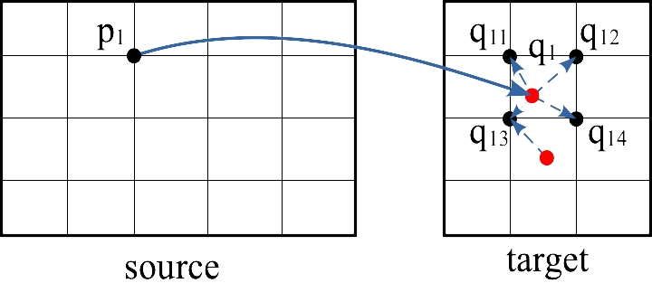

# Differentiable Image Warping (CUDA)

This is the official implementation of Differentiable Image Warping, which is "the reblur module" in "[Weakly-supervised Depth Estimation and Image Deblurring via Dual-Pixel Sensors]()".

## Requirements
```
matplotlib==3.3.4
numpy==1.19.5
scipy==1.5.4
setuptools==58.0.4
torch==1.7.0+cu110
```
For the CUDA environment and test data processing, we use
```
CUDAtoolkit 10.0.130
CUDA 10.0
MatLab (to generate test data)
```
**Note:** user can change the versions of these packages because our CUDA code is not version-specified.
One may need to change -std=c++11 to -std=c++14 in [setup.py](src/cuda/setup.py) for a higher CUDA version if related errors occur.

## Compile for CUDA Library
The source code of C++ and CUDA is provided in [src/cuda](src/cuda/).
To compile for the CUDA library, please set up the environment and run the compiling file step-by-step as follows.
- Add library develop path in bashrc as
    ```bash
    # Add library path to bashrc
    vim ~/.bashrc
    export PYTHONPATH=[path]/Install/DiffImageWarping:$PYTHONPATH
    source ~/.bashrc
    ```
- Ensure "[path]/Install/DiffImageWarping" is created, then add it to library compiling setup as

    ```bash
    cd [repository root]/src
    vim compile.sh

    # Optional.
    replace "~/Install/DiffImageWarping" by "[path]/Install/DiffImageWarping"
    ```

- Compile CUDA library in "[repository root]/src" as below.
Re-compiling will rewrite the library.
    ```bash
    # Library will be stored in "[repository root]/src/cuda/lib_diffimagewarping"
    ./compile.sh
    ```

## Differentiable Image Warping in PyTorch
- Forward propagation is performed by assigning weighted intensity of a pixel $q_i$ to its 4 neighbors $q_{ij}$ by emposing pixel disparity (depth)
to coordinate weight $g(\cdot, \cdot)$, following weighted sum of such neighbouring pixels to pixel $q_{ij}$.

  More implementation details are provided in [implementation notes](doc/implementation_notes.pdf).

  <!--  -->
  <div style="text-align: center"></div>

- **How to Use:** the PyTorch [ImageWarpingLayer](src/diff_image_warping.py) is demonstrated with [an example](src/unittest/test_diff_image_warping.py).
    ```bash
    cd src/unittest
    python test_diff_image_warping.py
    ```
  **Code Sketch:**
  ```python
    from src.diff_image_warping import ImageWarpingLayer

    # Set a RGB image and a disparity map.
    # RGB_img: (batch, channel, height, width).
    # depth: (batch, height, width).
    # One can get example data by referring to src/unittest/test_diff_image_warping.py.
    RGB_img = [your data]
    depth = [your data]

    # Build an image warping layer.
    image_warping_layer = ImageWarpingLayer(enable_left=True, enable_right=True)

    # Set verbose False, return averaged warped left/right images.
    img_left_avg, img_right_avg = image_warping_layer(
        RGB_img.cuda(),
        depth.cuda(),
        verbose=False
    )

    # Set verbose True, return left/right images without averaging
    # and the counting of pixel mapping.
    _, _, img_left, img_right, count_left, count_right = image_warping_layer(
        RGB_img.cuda(),
        depth.cuda(),
        verbose=True
    )
  ```

- (Optional) Time comparison with [MatLab script](src/ablation/matlab/simulator_image_warping_extrapol.m)
and [Python script](src/ablation/python/simulator_image_warping.py).

  a) Real data with size: (batch, channel, height, width)=(1, 3, 480, 640).
  To dump data for PyTorch and CUDA versions, run [script](src/ablation/matlab/simulator_image_warping_extrapol.m) to generate "matlab.mat" in [./data](data).
  Max value is 20.93.
  
  <center>

  | | MatLab  | PyTorch GPU | CUDA
  --- | --- | --- | ---
  Forward Time| 170s | 2257s | 1.11ms
  Forward Max Error | - | 0 | ~9.5e-6

  </center>

  b) Simulated data with size: (batch, channel, height, width)=(8, 3, 32, 64).
  Our CUDA version is averaged by **1000 iterations**.
  
  Corresponding max values in forward is 107.0231 and
  in backward 73565.67.
  This clarify the max errors caused by
  *round-off error of single-floating point operation*.
  For instance, with 7-digit precision,
  107.0231 has 4-digit tolerance in decimal,
  73565.67 has 2-digit
  tolerance in decimal.
  The order of sum operations in CUDA also affects the errors, particularly the backward max error.
  
  <center>

    | | PyTorch GPU | CUDA
    --- | --- | ---
    Forward Time| 75s| 0.41ms
    Forward Max Error | - | ~1.5e-4
    Backward Time| 219s | 0.08ms
    Backward Max Error | - | ~3.9e-3
  
  </center>

## Reference
If this repository is useful for you, please cite the following paper.
```bibtex
@misc{Pan2024,
    title        = {Weakly-supervised Depth Estimation and Image Deblurring via Dual-Pixel Sensors},
    author       = {Liyuan Pan and Richard Hartley and Liu Liu and Zhiwei Xu and Shah Chowdhury and Yan Yang and Hongguang Zhang and Hongdong Li and Miaomiao Liu},
    year         = {2024},
    howpublished = {IEEE Transactions on Pattern Analysis and Machine Intelligence}
}
```

## License
This code is distributed under the MIT License.

## Contact
For technical support of this library and the PyTorch layer, please contact [Zhiwei Xu](mailto:zwxu064@gmail.com).
For project support and neural network architecture, please contact [Liyuan Pan](mailto:liyuan.pan@bit.edu.cn).